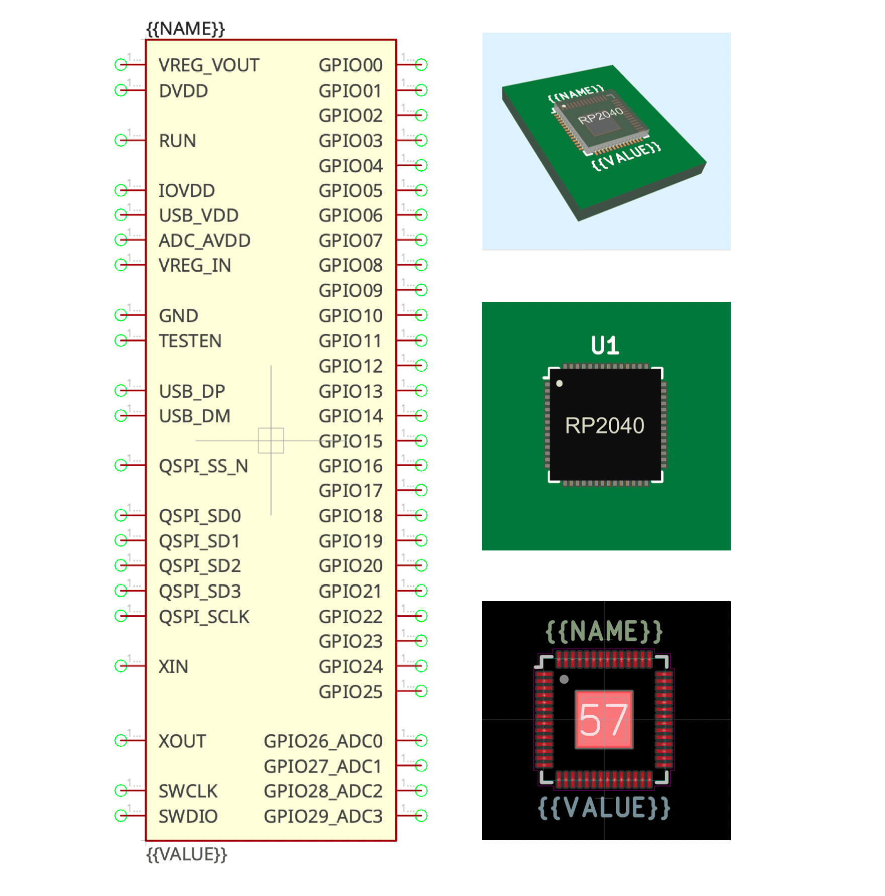

# rp2040.lplib

## Description

This is a [LibrePCB](https://librepcb.org) library for [RP2040](https://www.raspberrypi.com/documentation/microcontrollers/rp2040.html) microcontroller from Raspberry Pi.

Unofficial library, not endorsed by Raspberry Pi Ltd.

Work in progress. Current status: symbol, footprint, package and 3D-model are implemented, not tested yet.

## License

Creative Commons (CC0-1.0). For the license text, see [LICENSE](LICENSE).
